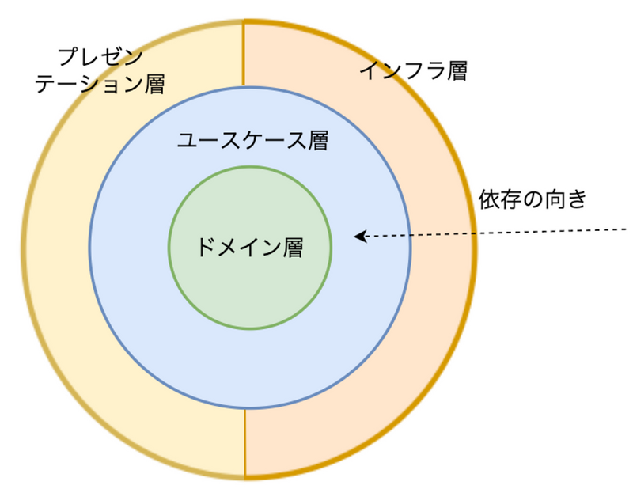
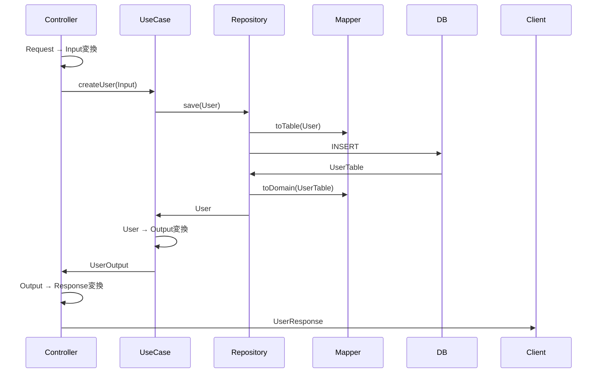

# アーキテクチャ設計

## 概要

このプロジェクトでは、**ドメイン駆動設計(DDD)** と **オニオンアーキテクチャ** を採用しています。
将来的に**CQRS**を採用するかもしれません

### 基本原則

1. **依存関係の方向**: 外側の層は内側の層に依存できるが、内側の層は外側の層に依存してはならない
2. **ドメイン層の独立性**: ドメイン層はフレームワークやライブラリに依存しない
3. **インターフェースによる抽象化**: リポジトリなど外部依存はインターフェースで抽象化

## アーキテクチャ構造

### オニオンアーキテクチャイメージ



### ディレクトリ構造

```
src/main/kotlin/com/example/obybackend/
├── domain/                         # ドメイン層(最内部)
│   ├── entity/                    # エンティティ
│   ├── value/                     # 値オブジェクト
│   ├── repository/                # リポジトリインターフェース
│   └── service/                   # ドメインサービス
│
├── usecase/                        # ユースケース層
│   └── {機能名}/                  # 機能ごとのディレクトリ
│       ├── {機能名}UseCase.kt     # ユースケース
│       ├── xxxInput.kt            # 入力DTO
│       └── xxxOutput.kt           # 出力DTO
│
├── infrastructure/                 # インフラストラクチャ層(最外部)
│   ├── postgres_jdbc/             # PostgreSQL + JDBC
│   │   └── {機能名}/              # 機能ごとのディレクトリ
│   │       ├── {機能名}Repository.kt  # リポジトリ実装
│   │       ├── {機能名}Table.kt       # データベースモデル
│   │       └── {機能名}Mapper.kt      # ドメイン ⟷ DBモデルの変換
│   └── config/                    # Spring設定
│
└── presentation/                   # プレゼンテーション層(最外部)
    └── controller/                # コントローラー
        └── {機能名}/              # 機能ごとのディレクトリ
            ├── {機能名}Controller.kt
            ├── xxxRequest.kt      # リクエストDTO
            └── xxxResponse.kt     # レスポンスDTO
```

## 依存関係のルール

### 許可される依存関係

```
Presentation層 → UseCase層 → Domain層 ← Infrastructure層
```

- Presentation 層: UseCase 層に依存可
- UseCase 層: Domain 層に依存可
- Infrastructure 層: Domain 層に依存可(インターフェース実装のため)
- Domain 層: **他のどの層にも依存しない**

### 禁止事項

❌ **Domain 層が外部に依存する**

```kotlin
// NG: ドメイン層でSpringのアノテーションを使う
@Service // これはNG
class UserService { }
```

❌ **Domain 層が Infrastructure 層に依存する**

```kotlin
// NG: ドメイン層でJDBCモデルを使う
class User(val userTable: UserTable) // これはNG
```

❌ **UseCase 層が Presentation 層に依存する**

```kotlin
// NG: UseCaseでRequestを受け取る
fun createUser(request: CreateUserRequest) // これはNG
```

## データフロー


