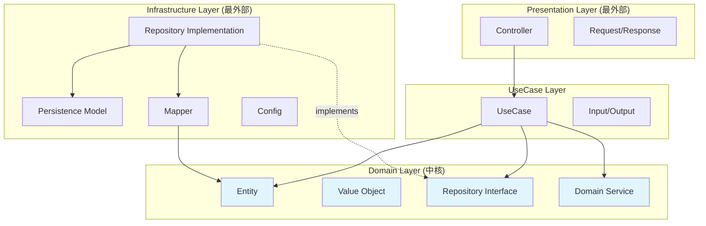
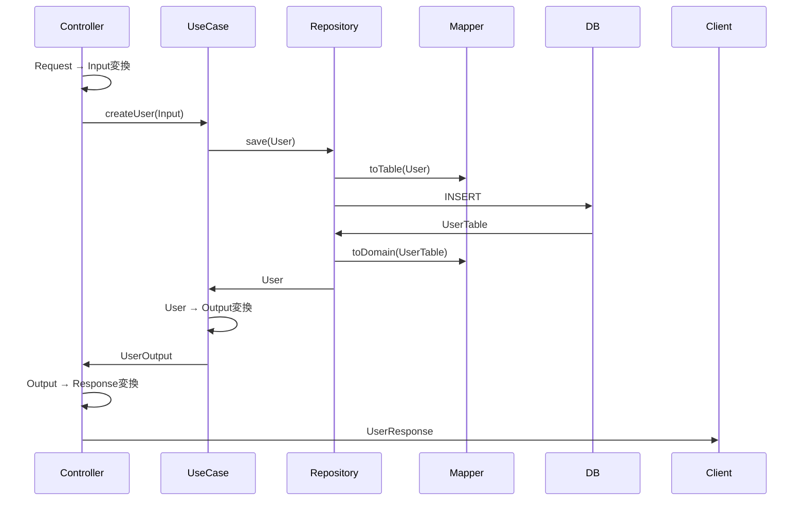

# アーキテクチャ設計

## 概要

このプロジェクトでは、**ドメイン駆動設計(DDD)** と **オニオンアーキテクチャ** を採用しています。
将来的に**CQRS**を採用するかもしれません

### 基本原則

1. **依存関係の方向**: 外側の層は内側の層に依存できるが、内側の層は外側の層に依存してはならない
2. **ドメイン層の独立性**: ドメイン層はフレームワークやライブラリに依存しない
3. **インターフェースによる抽象化**: リポジトリなど外部依存はインターフェースで抽象化

## アーキテクチャ構造

### 全体構造図イメージ



### ディレクトリ構造

```
src/main/kotlin/com/example/obybackend/
├── domain/                         # ドメイン層(最内部)
│   ├── entity/                    # エンティティ
│   ├── value/                     # 値オブジェクト
│   ├── repository/                # リポジトリインターフェース
│   └── service/                   # ドメインサービス
│
├── usecase/                        # ユースケース層
│   └── {機能名}/                  # 機能ごとのディレクトリ
│       ├── {機能名}UseCase.kt     # ユースケース
│       ├── xxxInput.kt            # 入力DTO
│       └── xxxOutput.kt           # 出力DTO
│
├── infrastructure/                 # インフラストラクチャ層(最外部)
│   ├── persistence/               # 永続化
│   │   ├── repository/           # リポジトリ実装
│   │   ├── model/                # データベースモデル
│   │   └── mapper/               # ドメイン ⟷ 永続化モデルの変換
│   └── config/                    # Spring設定
│
└── presentation/                   # プレゼンテーション層(最外部)
    └── controller/                # コントローラー
        └── {機能名}/              # 機能ごとのディレクトリ
            ├── {機能名}Controller.kt
            ├── xxxRequest.kt      # リクエストDTO
            └── xxxResponse.kt     # レスポンスDTO
```

## 各層の詳細

### Domain 層

- **entity/**: ビジネス上の概念。一意な識別子を持ち、ビジネスロジックを含む
- **value/**: 値オブジェクト。不変で等価性は値で判断(例: Email, Money)
- **repository/**: リポジトリのインターフェース。実装は infrastructure 層
- **service/**: 複数エンティティにまたがるドメインロジック

### UseCase 層

- **{機能名}/**: 機能ごとのディレクトリ(例: user/, message/)
- **{機能名}UseCase.kt**: その機能の全ユースケース。トランザクション境界
- **xxxInput.kt / xxxOutput.kt**: ユースケース層用の DTO

### Infrastructure 層

- **persistence/repository/**: Repository インターフェースの実装
- **persistence/model/**: DB テーブルに対応するクラス(@Table, @Id など)
- **persistence/mapper/**: ドメインエンティティ ⟷ DB モデルの変換
- **config/**: Spring 設定、Bean 定義

### Presentation 層

- **controller/{機能名}/**: 機能ごとのディレクトリ
- **{機能名}Controller.kt**: HTTP リクエスト処理、Request→Input/Output→Response 変換
- **xxxRequest.kt / xxxResponse.kt**: HTTP リクエスト/レスポンス用 DTO

## 依存関係のルール

### 許可される依存関係

```
Presentation層 → UseCase層 → Domain層 ← Infrastructure層
```

- Presentation 層: UseCase 層に依存可
- UseCase 層: Domain 層に依存可
- Infrastructure 層: Domain 層に依存可(インターフェース実装のため)
- Domain 層: **他のどの層にも依存しない**

### 禁止事項

❌ **Domain 層が外部に依存する**

```kotlin
// NG: ドメイン層でSpringのアノテーションを使う
@Service // これはNG
class UserService { }
```

❌ **Domain 層が Infrastructure 層に依存する**

```kotlin
// NG: ドメイン層でJDBCモデルを使う
class User(val userTable: UserTable) // これはNG
```

❌ **UseCase 層が Presentation 層に依存する**

```kotlin
// NG: UseCaseでRequestを受け取る
fun createUser(request: CreateUserRequest) // これはNG
```

## 命名規則

### クラス名

| 種類                      | 命名規則                   | 例                           |
| ------------------------- | -------------------------- | ---------------------------- |
| Entity                    | 名詞                       | `User`, `Message`, `Profile` |
| Value Object              | 名詞                       | `Email`, `UserId`, `Money`   |
| Repository Interface      | `{Entity名}Repository`     | `UserRepository`             |
| Repository Implementation | `Jdbc{Entity名}Repository` | `JdbcUserRepository`         |
| Persistence Model         | `{Entity名}Table`          | `UserTable`                  |
| Domain Service            | `{目的}Service`            | `UserAuthenticationService`  |
| UseCase                   | `{機能名}UseCase`          | `UserUseCase`                |
| Input                     | `{操作名}Input`            | `CreateUserInput`            |
| Output                    | `{Entity名}Output`         | `UserOutput`                 |
| Controller                | `{機能名}Controller`       | `UserController`             |
| Request                   | `{操作名}Request`          | `CreateUserRequest`          |
| Response                  | `{Entity名}Response`       | `UserResponse`               |
| Mapper                    | `{Entity名}Mapper`         | `UserMapper`                 |

### ファイル配置

- 1 ファイル 1 クラス
- ファイル名とクラス名を一致させる
- パッケージ構造はディレクトリ構造に従う

## データフロー


