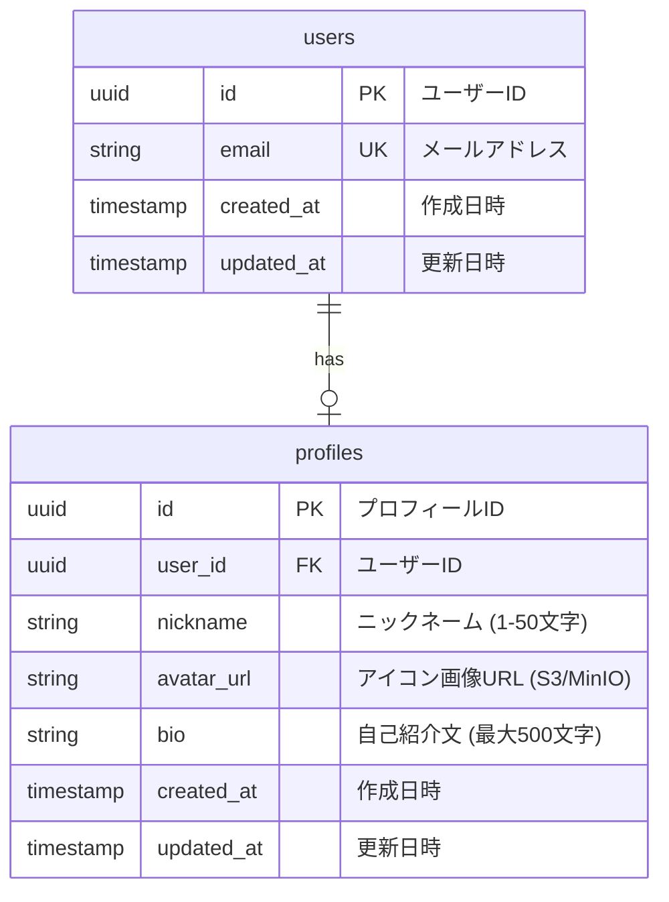

# ER 図

## テーブル説明

### users テーブル

認証情報を管理するテーブル

- `id`: ユーザーの一意識別子（UUID）
- `email`: ログインに使用するメールアドレス（一意制約）
- `created_at`: アカウント作成日時
- `updated_at`: 最終更新日時

### profiles テーブル

ユーザーのプロフィール情報を管理するテーブル

- `id`: プロフィールの一意識別子（UUID）
- `user_id`: users テーブルへの外部キー
- `nickname`: 表示名（1-50 文字、バリデーション必要）
- `avatar_url`: S3/MinIO に保存されたアイコン画像の URL
- `bio`: 自己紹介文（最大 500 文字）
- `created_at`: プロフィール作成日時
- `updated_at`: 最終更新日時

## 関連エンドポイント

- `GET /users/me` (U1): 自分のプロフィール取得
- `PUT /users/me` (U2): 自分のプロフィール更新
- `POST /users/me/avatar` (U3): アイコン画像アップロード
- `DELETE /users/me/avatar` (U4): アイコン削除
- `GET /users/{userId}` (U5): 他ユーザーのプロフィール取得
